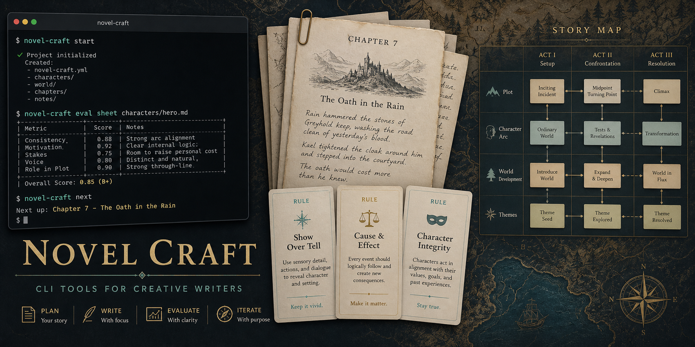

# Novel Craft



[](https://github.com/ImDanielGitHub/novel-craft/actions/workflows/ci.yml)
[](LICENSE)
[](https://www.npmjs.com/package/novel-craft)

**A craft-aware CLI for planning, evaluating, and continuing long-form fiction.**

Novel Craft is a local-first command-line tool for writers and writing agents. It does not call a model for you. Instead, it creates the story state, rule guides, context packets, rubrics, score sheets, and review prompts that you can give to any LLM.

## Install

The public install target is npm/npx:

```bash
npx novel-craft start
```

Local tarball testing before publish:

```bash
cargo build --release
cp target/release/novel-craft npm/bin/novel-craft-$(rustc -vV | awk '/host:/ {print $2}')
npm pack
npm install -g ./novel-craft-0.1.0.tgz
novel-craft doctor --json
npm uninstall -g novel-craft
```

From a source checkout:

```bash
cargo run --bin novel-craft -- start --no-input --defaults
```

The primary command is `novel-craft`. A convenience alias, `novel`, is also built where package managers support it.

See [docs/npm-install.md](https://github.com/ImDanielGitHub/novel-craft/blob/main/docs/npm-install.md) for local install, `npx`, and PATH troubleshooting.

## Quick Start

Beginner guided setup:

```bash
novel-craft start
```

Agent-friendly setup with defaults:

```bash
novel-craft start --no-input --defaults --json
```

Evaluate an existing chapter:

```bash
novel-craft eval sheet chapter.md --json
novel-craft creative novelty chapter.md --json
novel-craft eval reader-check chapter.md --profile fast-webnovel --json
```

Compare two draft ideas:

```bash
novel-craft creative tournament --idea "weak-to-strong kingdom-building isekai" --json
novel-craft eval compare draft-a.md draft-b.md --json
```

Build a context packet for another model:

```bash
novel-craft scene create chapter_01_scene_01 \
  --goal "A weak newcomer promises shelter before winter arrives" \
  --conflict "The settlement has no food and the guild hides the real danger" \
  --turn "The system rewards the promise instead of a kill"

novel-craft context build chapter_01_scene_01 --out .novel/context/ch01s01.md
```

Check the local install and project state:

```bash
novel-craft doctor --json
```

## What It Does

- Creates `.novel/` project state for characters, scene cards, plot threads, memory, context packets, eval records, and reports.
- Bundles effect-first craft rules with examples and legitimate rule-breaking cases.
- Generates model-neutral prompt packets for story planning, drafting, review, revision, and continuity sync.
- Checks prose and story signals such as passive voice, filter words, abstract emotion, trope saturation, novelty, reader-level fit, voice drift, repeated beats, promises, and payoff pressure.
- Exports Codex skills so agents can call the CLI rather than stuffing every rule into one prompt.

## What It Does Not Do

- It does not call OpenAI, Anthropic, Ollama, or any hosted model in v1.
- It does not store API keys.
- It does not scrape hosted fiction.
- It does not train on or imitate copyrighted novels.
- It does not claim objective literary quality. Metrics route attention; the author decides.

## CLI Shape

Core groups:

```text
novel-craft start
novel-craft init
novel-craft doctor
novel-craft character
novel-craft scene
novel-craft plot
novel-craft matrix
novel-craft context
novel-craft rules
novel-craft creative
novel-craft eval
novel-craft lint
novel-craft audit
novel-craft memory
novel-craft skills
novel-craft export
```

Human-friendly commands can prompt. Agent-friendly commands support `--json`, `--out`, and non-interactive defaults where relevant.

## Skills

List bundled skills:

```bash
novel-craft skills list
```

Export them:

```bash
novel-craft skills export --out ./skills-export
```

Dry-run install to a Codex skills directory:

```bash
novel-craft skills install --target ~/.codex/skills --dry-run
```

Check skill export/install readiness:

```bash
novel-craft skills doctor --target ~/.codex/skills --json
```

## Source Policy

Novel Craft is for user-owned drafts, licensed/public-domain material, and high-level craft pattern notes. Hosted fiction can be observed for structure, cadence, and genre conventions, but should not be bulk copied, stored as a corpus, embedded, trained on, or imitated without permission.

See [docs/source-policy.md](https://github.com/ImDanielGitHub/novel-craft/blob/main/docs/source-policy.md).

## Development

```bash
cargo fmt
cargo check
cargo clippy -- -D warnings
cargo test
npm run pack:dry
```

The Rust CLI is the only supported public implementation.

## Publishing

Publishing is maintainer-only and not automatic from local development. The first release path is:

1. verify the clean Rust-only tree
2. create a private GitHub repo
3. pass CI
4. configure npm trusted publishing
5. create a signed release tag
6. publish through GitHub Actions with provenance

See [docs/npm-publish.md](https://github.com/ImDanielGitHub/novel-craft/blob/main/docs/npm-publish.md) and [docs/release-process.md](https://github.com/ImDanielGitHub/novel-craft/blob/main/docs/release-process.md).

## Governance

Public PRs are welcome, but merges and releases are guarded by maintainer review, CODEOWNERS, branch protection, and CI. See:

- [CONTRIBUTING.md](https://github.com/ImDanielGitHub/novel-craft/blob/main/CONTRIBUTING.md)
- [SECURITY.md](https://github.com/ImDanielGitHub/novel-craft/blob/main/SECURITY.md)
- [GOVERNANCE.md](https://github.com/ImDanielGitHub/novel-craft/blob/main/GOVERNANCE.md)
- [docs/release-process.md](https://github.com/ImDanielGitHub/novel-craft/blob/main/docs/release-process.md)
